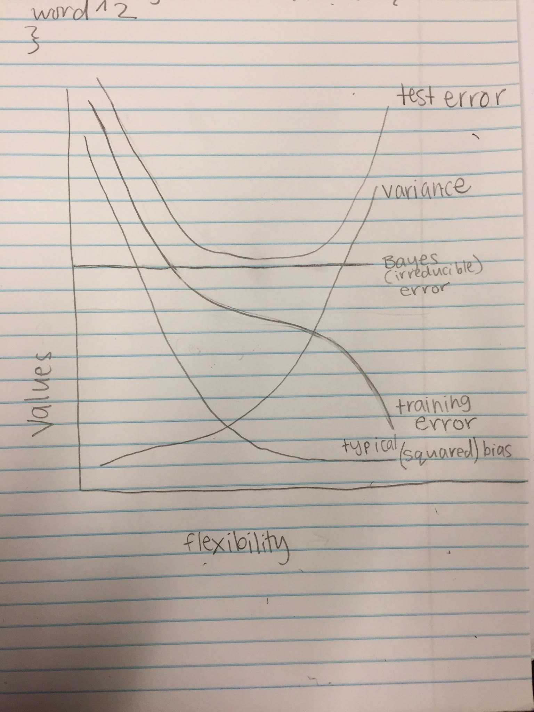

---
output:
  pdf_document: default
  html_document: default
---
# Topic 1 Exercises
# Shelby Witherby

# DISCUSSION QUESTIONS:

# ISL 2.4.1
# a) With more data, you can train the model and support more flexibility. Therefore, the performance of the flexible model would be best.
# b) The performance of the inflexible model would be best. We don't have enough observations to train the model.
# c) The performance of the flexible model would be best. Since it is highly non-linear, the linear model wouldn't provide an accurate estimation for the data. 
# d) The performance of the inflexible model would be best. The flexible model would try to fit to the noise.


# ISL 2.4.3
# a) below you can see my sketch of curves for bias-variance decomposition


# b) The variance "refers to the amount f hat would change if we estimated it with a different training data set," and "more flexible statistical methods have higher variance" according to the textbook. Thus, variance increases as flexibility increases. The training data declines as flexibility increases because as flexibility increases, the f curve fits the observed data more closely. The test error declines at first as flexibility increases, but then levels off and starts to increase again, because eventually we would be overfitting the data (provided small training error). The irreducible error is the minimum lower bound for the test error, and is a constant, so it is a straight line parallel to the x axis. The squared bias starts really high, and decreases with increased flexibility. This is because a very simple (not flexible) model, like linear regression, probably won't represent most real-life situations.

# ISL 2.4.6
# Parametric machine learning algorithms simplify the function to a known form. You select a form for the function (linear for example) and then learn the coefficients for the function from the training data. The benefits of parametric machine learning algorithms are simplicity, speed, and they require less training data. However, parametric machine learning algortithms are that they have a limited complexity, and can be a poor fit. 
# Nonparametric machine learning algorithms do not assume the form of the training data, and thus are able to fit a large number of functional forms. Nonparametric machine learning algorithms are flexible, and therefore can result in better performance models for prediction. However, they require a lot more training data, is slower, and sometimes can result in overfitting. 

# COMPUTING ASSIGNMENT:

# ISL 2.4.8


```{r}
library(ISLR)
data(College)
college <- read.csv("http://www-bcf.usc.edu/~gareth/ISL/College.csv", header = TRUE)
college <- College
#rownames(college)=college[,1]
View(college)
#college = college[,-1]
#fix(college)
summary(college)
pairs(college[,1:10])
plot(Outstate ~ Private, data = college)
Elite = rep("No", nrow(college))
Elite[college$Top10perc >50] = "Yes"
Elite = as.factor(Elite)
college = data.frame(college, Elite)
summary(college)
plot(Outstate ~ Elite, data = college)
```


# ISL 2.4.9

```{r}
library(ISLR)
data(Auto)
Auto <- Auto[ - complete.cases(Auto),]
summary(Auto)
```

# a) mpg, cylinders, displacement, horsepower, weight, acceleration, and year are quantitative. Origin and name are qualitative.

```{r}
with(Auto, range(mpg))
with(Auto, range(cylinders))
with(Auto, range(displacement))
with(Auto, range(horsepower))
with(Auto, range(weight))
with(Auto, range(acceleration))
with(Auto, range(year))
```

# b) The range of mpg is 9 to 46.6. The range of cylinders is 3 to 8. The range of displacement is 68 to 455. The range of horsepower is 46 to 230. The range of weight is 1613 to 5140. The range of acceleration is 8 to 24.8. The range of year is 70 to 82. 

```{r}
with(Auto, c(mean(mpg), sd(mpg)))
with(Auto, c(mean(cylinders), sd(cylinders)))
with(Auto, c(mean(displacement), sd(displacement)))
with(Auto, c(mean(horsepower), sd(horsepower)))
with(Auto, c(mean(weight), sd(weight)))
with(Auto, c(mean(acceleration), sd(acceleration)))
with(Auto, c(mean(year), sd(year)))
```

# c) The mean of mpg is 23.5 and the standard deviation is 7.8. The mean of cylinders is 5.5 and the standard deviation is 1.7. The mean of displacement is 194.1 and the standard deviation is 104.6. The mean of horsepower is 104.4 and the standard deviation is 38.5. The mean of weight is 2976.2 and the standard deviation is 850.1. The mean of acceleration is 15.6 and the standard deviation is 2.8. The mean of year is 76 and the standard deviation is 3.7. 

```{r}
Auto2 <- Auto[ - (10:85), ]

# The ranges
with(Auto2, range(mpg))
with(Auto2, range(cylinders))
with(Auto2, range(displacement))
with(Auto2, range(horsepower))
with(Auto2, range(weight))
with(Auto2, range(acceleration))
with(Auto2, range(year))

# The mean and standard deviations
with(Auto2, c(mean(mpg), sd(mpg)))
with(Auto2, c(mean(cylinders), sd(cylinders)))
with(Auto2, c(mean(displacement), sd(displacement)))
with(Auto2, c(mean(horsepower), sd(horsepower)))
with(Auto2, c(mean(weight), sd(weight)))
with(Auto2, c(mean(acceleration), sd(acceleration)))
with(Auto2, c(mean(year), sd(year)))
```


# d) The range of mpg is 11 to 46. The range of cylinders is 3 to 8. The range of displacement is 68 to 455. The range of horsepower is 46 to 230. The range of weight is 1649 to 4997. The range of acceleration is 8.5 to 24.8. The range of year is 70 to 82. The mean of mpg is 24 with a standard deviation of 7.9. The The mean of cylinders is 5 with a standard deviation of 1.7. The mean of displacement is 187 with a standard deviation of 100. The mean of horsepower is 100.7 with a standard deviation of 35.97. The mean of weight is 2934.7 with a standard deviation of 812. The mean of acceleration is 15.7 with a standard deviation of 2.7. The mean of year is 77 with a standard deviation of 3.

```{r}
pairs(Auto)
```

# e) #HA! I made scatterplots of relationships with EVERY predictor!! weight has a positive linear relationship with horsepower. weight has a positive linear relationship with displacement. weight has a negative linear relationship with mpg. horsepower has a negative relationship with mpg. displacement has a negative relationship with mpg. Though the variance is high, year is positively associated with mpg - newer cars get better mileage. 

# f) Yes, many predictors might be useful to predict mpg. For example, variables displacement, horsepower and weight appear to have a strong correlation with mpg. My plots show that more weight results in lower mpg, more horsepower results in lower mpg, more displacement results in lower mpg. and a larger year (newer) results in higher mpg.

# THEORY ASSIGNMENT:

# ISL 2.4.2

# a) regression, inference, n=500, p=3
# b) classification, prediction, n=20, p=13
# c) regression, prediction, n = 52, p = 3

# ISL 2.4.7

```{r}
sqrt((0-0)^2 + (3-0)^2 + (0-0)^2)
sqrt((2-0)^2 + (0-0)^2 + (0-0)^2)
sqrt((0-0)^2 + (1-0)^2 + (3-0)^2)
sqrt((0-0)^2 + (1-0)^2 + (2-0)^2)
sqrt((-1-0)^2 + (0-0)^2 + (1-0)^2)
sqrt((1-0)^2 + (1-0)^2 + (1-0)^2)
```

# a) 
# Obs. 1: 3
# Obs. 2: 2 
# Obs. 3: sqrt{10}
# Obs. 4: sqrt{5} 
# Obs. 5: sqrt{2}
# Obs. 6: sqrt{3}


# b) Obsesrvation 5 has the smallest value for the Euclidian distance and the test point. As such, it will be the value associated with obs 5, which is green. 

# c) With k = 3, the three nearest are observations 5 (green), 6 (red), and 2 (red). Therefore, it will be red.

# d) If the Bayes decision boundary in this problem is highly non-linear, we would expect the best value for K to be small. If it is highly nonlinear, that would mean that the model values change quickly. As such, models with small k values are able to change quickly. 


 
